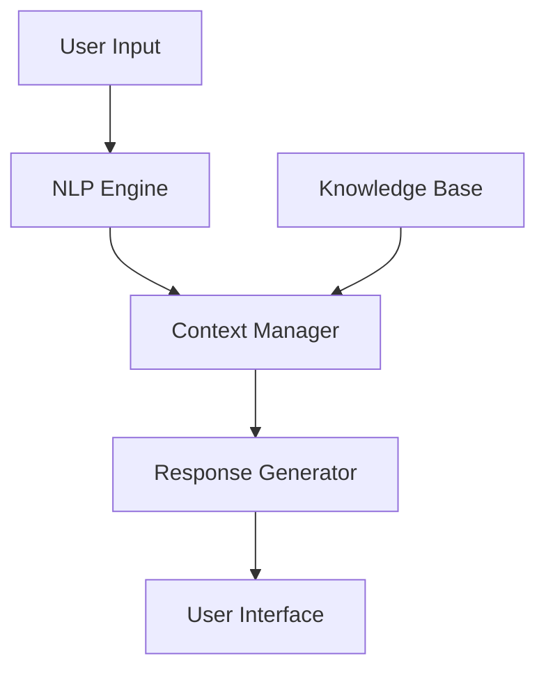

<div align="center">

# 🌟 Asha AI - Your Intelligent Career Companion 🌟

[](https://www.python.org/)
[](https://fastapi.tiangolo.com/)
[](LICENSE)

*Empowering Women's Careers Through AI-Driven Guidance* 💫

Created with 💖 by **TURANYA MISHRA**

[Features](#-key-features) • [Quick Start](#-quick-start) • [Usage](#-usage) • [Documentation](#-documentation) • [Connect](#-connect)

</div>

---

## ✨ About Asha

> "Your dreams are valid, and your career goals matter. Let's achieve them together!" - Asha AI

Asha is an advanced AI career companion designed specifically for women professionals. Using cutting-edge natural language processing and context-aware responses, Asha provides personalized career guidance in both English and Hinglish, making professional development more accessible and inclusive.

### 🎯 Why Asha?

- 🤝 **Personal Touch**: Understands your unique career journey
- 🌏 **Inclusive Design**: Supports both English and Hinglish
- 🎓 **Smart Learning**: Adapts to your career goals
- 🔒 **Privacy First**: Secure and confidential interactions
- ⚡ **Real-time Updates**: Latest job market insights

## 🚀 Key Features

### 💼 Career Navigation
- **Smart Job Search**
  - AI-powered job matching
  - Personalized recommendations
  - Remote work opportunities
  - Return-to-work programs

### 📚 Skill Development
- **Learning Pathways**
  - Tech certification courses
  - Leadership programs
  - Soft skills workshops
  - Industry-specific training

### 👥 Professional Growth
- **Career Support**
  - One-on-one mentorship
  - Resume optimization
  - Interview preparation
  - Salary negotiation tips

### 🌈 Community Features
- **Networking**
  - Connect with mentors
  - Join women's communities
  - Access success stories
  - Attend virtual events

## 🛠️ Quick Start

### Prerequisites
```bash
# Python 3.8 or higher required
python --version
```

### Installation
```bash
# Clone the repository
git clone https://github.com/username/asha-ai.git
cd asha-ai

# Create virtual environment
python -m venv venv
source venv/bin/activate  # Linux/Mac
venv\Scripts\activate     # Windows

# Install dependencies
pip install -r requirements.txt
```

### Launch Asha
```bash
python simple_chat.py
```

## 💬 Usage Examples

```python
# Career Guidance
You: "Tell me about career opportunities"
Asha: "✨ Here are some exciting paths for you:
      1. Technology & IT
      2. HR & Recruitment
      3. Sales & Marketing
      4. Finance & Accounting
      5. Operations
      
      Which field interests you? Type a number!"

# Hinglish Support
You: "career guidance chahiye"
Asha: "🌟 Main aapki help kar sakti hoon:
      1. Mentorship programs
      2. Resume review
      3. Interview preparation
      4. Career transition"
```

## 📚 Documentation

### Conversation Topics
- Career Planning
- Job Search
- Skill Development
- Interview Prep
- Work-Life Balance
- Leadership Development

### Supported Languages
- English (Primary)
- Hinglish (Hindi-English Mix)

## 🔧 Technical Architecture



## 🤝 Connect

<div align="center">

[](https://www.jobsforher.com)
[](https://www.linkedin.com/company/jobsforher)
[](https://twitter.com/jobsforher)

</div>

## 📈 Impact

- 🌟 **10,000+** Career Transformations
- 💼 **500+** Partner Companies
- 📚 **1,000+** Learning Resources
- 👥 **5,000+** Active Community Members

---

<div align="center">

### *Empowering Women, One Career at a Time* 💫

© 2025 TURANYA MISHRA. All Rights Reserved.

</div>